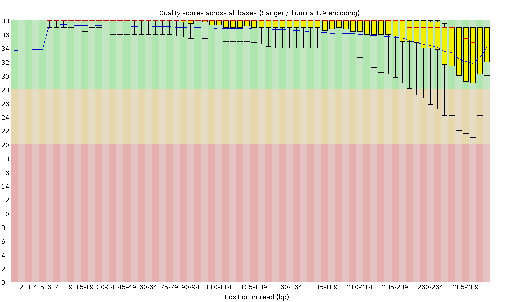
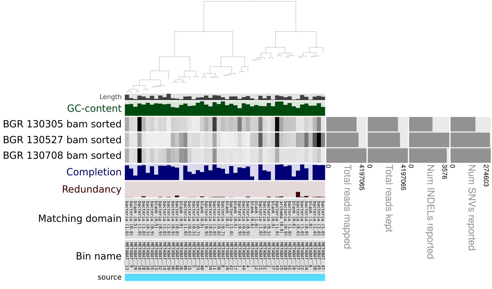
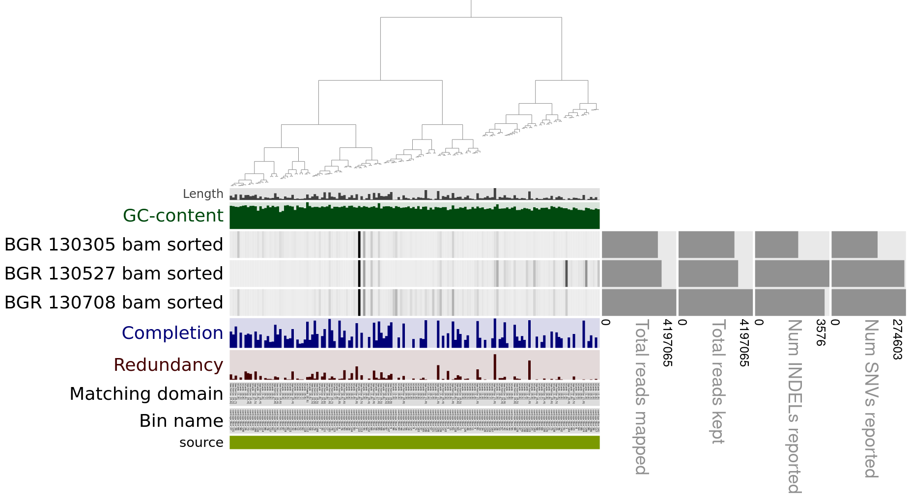
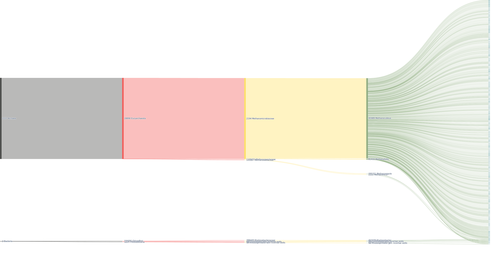
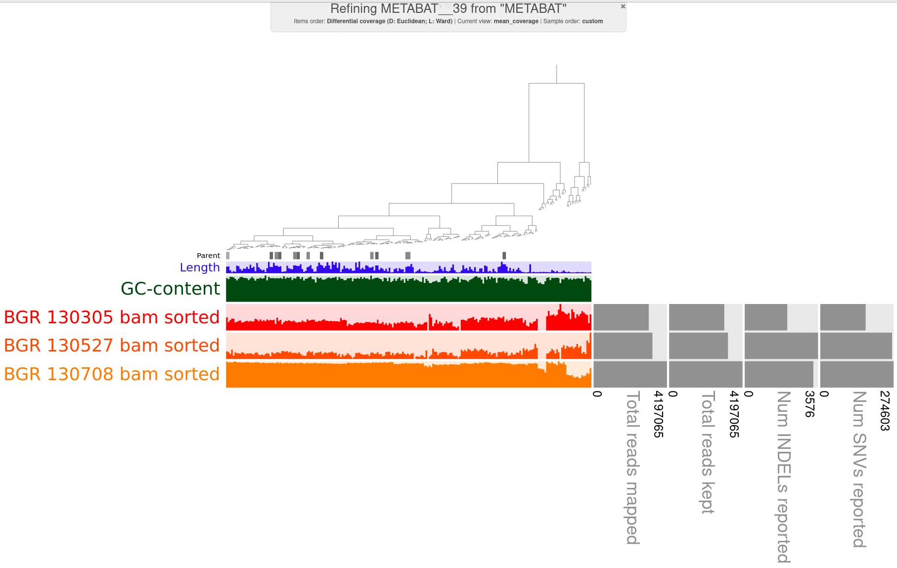
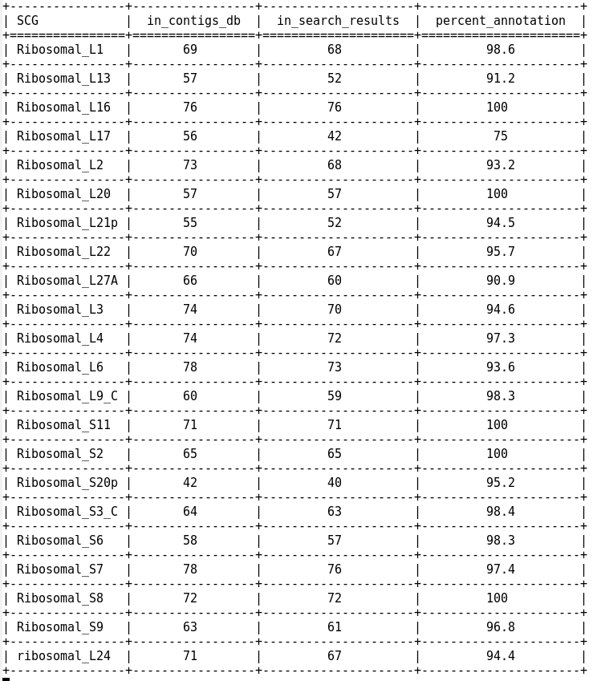
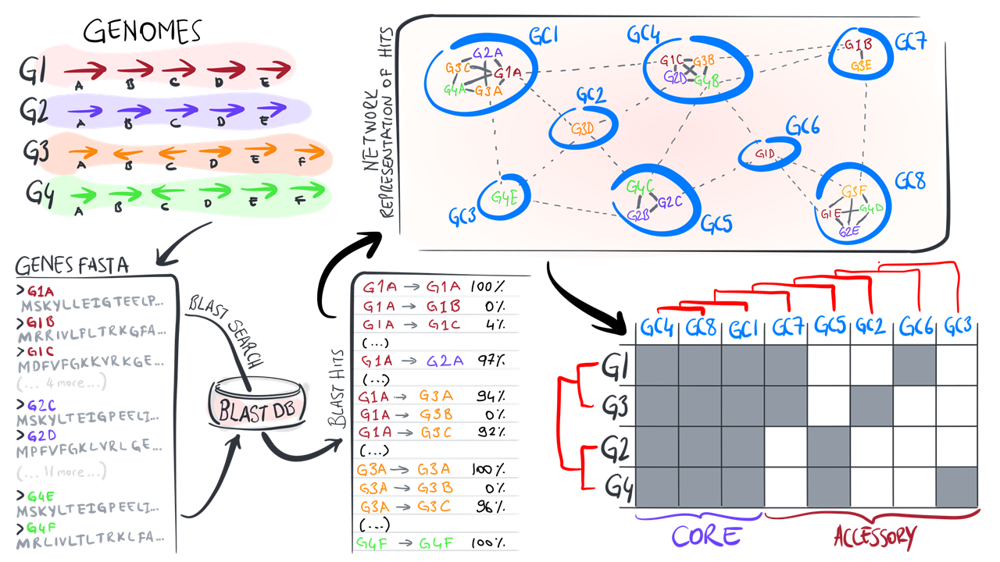
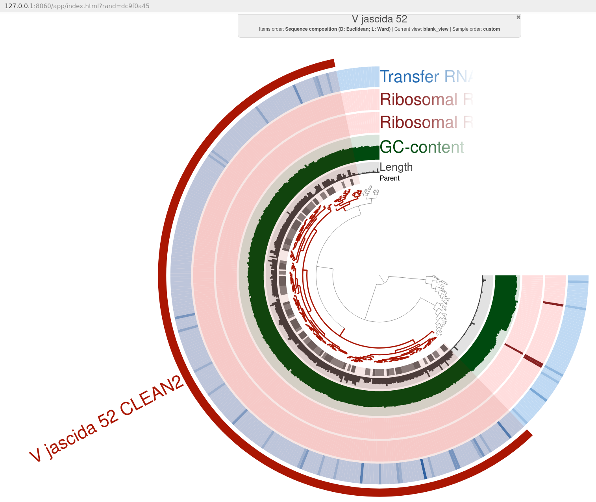

# Microbial Omics Course (biol217) Protocol - Nils Groeters

# Day 1: Introduction to Linux, Markdown, Git and Conda

### 1 Linux

What we have learned so far:

1. Basic Linux
2. Bioinformatic basics
3. Linux commands

- copy from one folder to another:

```sh
cp source destination
```

# Day 2: Introduction to Metagenomics and Metagenomic Workflow

*[Overview Workflow](./concepts_and_overviews/MAG_workflow.pdf)*

### Metagenomics

Only a small percentage of the global microbial diversity can be cultured in the lab. In order to study microbes in their natural environment, metagenomic analysis can be used. By sequencing of the genomic DNA, plasmids or transcriptomes it is possible to investigate the microbial diversity.


- Limitations: only proportions, not absolut values of microbes in the environment (see slide 16)

Amplicon Sequencing

- 16S ribisome: 2 gene fused together, very conserved over many domains with conserved and "hyper-variable" regions, conserved regions can be targeted by primers to amplify the vaaible regions
- merenlab.org/momics
- Limitation: only known regions betwenn primers are amplified, mostly 16S RNA (missing plasmids, phages, eucaryotes)
--> shotgun-metagenomic sequencing captures alle sequences

Metagenomic Workflow
(slide 40, 41)

 Sequencing:

- quality control (slide43)
- Phred score for probability of incorrect sequncing result (>20 is good)
- **fastq** file format = read file: contains short reads (up to 150bp)
- sequncing trimming for longer reads with bad quality at the end (phasing or signal decay)

Assembly:

- refernce-guided: known sequences from reference
- de-novo: overlap or de Bruijn
- k-mer: nr of nucleotides looked at at once

## Assembly of Short Read Sequences on the CAU Cluster (Workflow)

Connect to the CAU cluster by ssh and change to the working directory:

```bash
ssh -X sunam230@caucluster.rz.uni-kiel.de

cd $WORK
```

*Note: For every job a bash script needs to be submitted according to the CAU cluster documentation ([CAU-Cluster](https://www.hiperf.rz.uni-kiel.de/caucluster/)). In order to use the following prigrams the anvio-8 environment needs to be loaded by conda every time a new job is submitted.*

### Program Documentations

| Tool | Version | Repository |
| --- | --- | --- |
| fastqc | 0.12.1 | [FastQC](https://github.com/s-andrews/FastQC ) |
| fastp | 0.23.4 | [fastp](https://github.com/OpenGene/fastp ) |
| megahit | 1.2.9 | [megahit](https://github.com/voutcn/megahit ) |
| samtools | 1.19 | [samtools](https://github.com/samtools/samtools ) |
| QUAST | 5.2.0 | [quast](https://quast.sourceforge.net/quast ) |
| Bowtie2 | 2.4.5 | [bowtie2](https://bowtie-bio.sourceforge.net/bowtie2/index.shtml ) |
| binsanity | 0.5.3 | [binsanity](https://github.com/edgraham/BinSanity) |
| MetaBAT2 | 2.12.1 | [Metabat2](https://bitbucket.org/berkeleylab/metabat/src/master/ ) |
| DASTool | 1.1.5 | [DAS_Tool](https://github.com/cmks/DAS_Tool ) |
| anvi´o | 8 | [anvi’o](https://anvio.org/ ) |
| GUNC | 1.0.5 | [GUNC](https://grp-bork.embl-community.io/gunc/ ) |


### 1. Quality control of short raw reads by **fastqc**: 

- This program analysis the short read sequences and visualizes the quality scores. The command is included inside the bash script, containing the job, and is handed in on the cau cluster.

Create a new bash script file (.sh):

```bash
emacs [filename] &
```

```bash
#!/bin/bash
#SBATCH --nodes=1
#SBATCH --cpus-per-task=4
#SBATCH --mem=10G
#SBATCH --time=5:00:00
#SBATCH --job-name=fastqc
#SBATCH --output=fastqc.out
#SBATCH --error=fastqc.err
#SBATCH --partition=base
#SBATCH --reservation=biol217

module load gcc12-env/12.1.0
module load miniconda3/4.12.0
conda activate anvio-8

cd /work_beegfs/sunam230/[SOURCE DIRECTORY]

# a for loop is used to loop over i files with the ending *fastq.gz
for i in *fastq.gz; do fastqc $i -o [OUTPUT FILE]; done
```
Submit the job:

```bash
sbatch [filename]
```

Tracking the job on the cluster:
 ```bash
 squeue -u [USERNAME]
 ```


 Quality information from fastqc:

 

### 2. Cleaning/Trimming of raw reads by **fastp**: 

- This is done in pairs (R1/R2), which result from the sequencing method in both directions (pairwise). **fastp** can not run in a loop over multiple files and has to be executed seperatly for each file pair. The information on the quality of the reads (obtained from **fastqc**) is used for the following setting.

```
fastp -i ? -I ? -R ? -o ? -O ? -t 6 -q 20

> `--html` creates an .html report file in html format\
>`-i` R1 input file name\
>`-I` R2 input file name\
>`-R` report title, here ‘_report’ is added to each file\
>`-o` output_folder/R1.fastq.gz output file\
>`-O` output_folder/R2.fastq.gz output file\
>`-t` trim tail 1, default is 0, here 6 bases are trimmed\
>`-q` 20 reads with a phred score of <=20 are trimmed
```

```bash
#!/bin/bash
#SBATCH --nodes=1
#SBATCH --cpus-per-task=4
#SBATCH --mem=10G
#SBATCH --time=5:00:00
#SBATCH --job-name=fastp
#SBATCH --output=fastp.out
#SBATCH --error=fastp.err
#SBATCH --partition=base
#SBATCH --reservation=biol217

module load gcc12-env/12.1.0
module load miniconda3/4.12.0
conda activate anvio-8

cd /work_beegfs/sunam230/[SOURCE DIRECTORY]
fastp -i BGR_130708_mapped_R1.fastq.gz -I BGR_130708_mapped_R2.fastq.gz -R _report -o ../2_fastp/BGR_130708_mapped_clean_R1.fastq.gz -O ../2_fastp/BGR_130708_mapped_clean_R2.fastq.gz -t 6 -q 20

fastp -i [R1 FILE] -I [R2 FILE] -o [CLEANED R1 FILE] -O [CLEANED R2 FILE] -t -q
...
...
```

### 3. Assembly of the cleaned reads by **megahit**: 

- The program takes in all R1 and R2 short read pairs and the output is directed to one folder.

```bash
megahit -1 [R1 FILE] -1 [R1 FILE] -1 [R1 FILE] -2 [R2 FILE] -2 [R2 FILE] -2 [R2 FILE] --min-contig-len 1000 --presets meta-large -m 0.85 -o [OUTPUT FOLDER] -t 12        
```

# Day 3: From Contigs to Bins (Binning)

- Contigs: proportion of contigs do not mirror reality, inrormation from sequncing data needed
- k-mer of 4 best for computing
- sequnce composition into MAGs ???
- back mapping of all short reads to the reulting contig (by fastp) gives different coverages, usually ca 7 --> all contigs from one species should have similiar coverage
- Binning on slide 143 (basis GC-content, kmer composition, covarage for most programs)

- quality control (QC) of MAGs: marker genes (SCGs), genomic characteristics on slide 146
- 16S RNA data hard to resolve in MAGs
- Minimum information about MAG standards (MIMAG) to compare MAG qualities
- MAG: collection of many strains (NOT a single strain!!) 
- SNP analysis in the coverage: same SNPs are hint for same strain, different indicate strain divergence
- slide 151: fragmentation can be indicated by high number of contigs needed for one MAG
- 

## Workflow Quality Assessment of Assemblies

### 1. Count number of contigs in the assembly file:
```bash
grep -c ">" final.contigs.fa
```
### 2. Creating -fastg file for later visualization with **Bandage**:

```bash
megahit_toolkit contig2fastg 99 final.contigs.fa > final.contigs.fastg
```
Afterwards download the .fastg file to the local PC for visualization:

```bash
#ON A LOCAL TERMINAL
scp sunam230@caucluster.rz.uni-kiel.de:/work_beegfs/sunam230/...
```

### 3. Quality Assessment of Assemblies with **metaquast**:

```bash
metaquast -t 6 -o /PATH/TO/3_metaquast -m 1000 final.contigs.fa

# -t specifies the number of threads
# -m specifies the lower contig threshhold
```

N50: half the length of the longest assembled contig

L50:


## Workflow Genome Binning

### 1. Making the final contig file .fa compatible with anvi for mapping and binning later on:
```bash
anvi-script-reformat-fasta final.contigs.fa -o contigs.anvio.fa --min-len 1000 --simplify-names --report-file name_conversion.txt
```
### 2. Mapping of the cleaned raw reads (.fasta.gz files) to the reformated contig (.anvio.fa):

```shell script
#!/bin/bash
#SBATCH --nodes=1
#SBATCH --cpus-per-task=4
#SBATCH --mem=10G
#SBATCH --time=5:00:00
#SBATCH --job-name=mapping2
#SBATCH --output=mapping2.out
#SBATCH --error=mapping2.err
#SBATCH --partition=base
#SBATCH --reservation=biol217

module load gcc12-env/12.1.0
module load miniconda3/4.12.0
conda activate anvio-8

module load bowtie2

cd /work_beegfs/sunam230/Metagenomics/2_fastp
for i in `ls *_R1.fastq.gz`;
do
    second=`echo ${i} | sed 's/_R1/_R2/g'`
    bowtie2 --very-fast -x ../3_coassembly/contigs.anvio.fa.index -1 ${i} -2 ${second} -S ../4_mapping/"$i".sam
done
```

**bowtie2** produces a .sam file, which holds the coverage for ech contig sequence. These files are very big and need to be converted into binary alignment and map file (.bam) by **samtools**. These files can be visualized later:

```shell script
module load samtools
cd /work_beegfs/sunam230/[MAPPING OUTPUT]
for i in *.sam;
do samtools view -bS $i > "$i".bam; done
```
## Workflow Contigs Data Preparation (anvio)

### 1. Convert the .fa file (contigs) into .db file by **anvi-gen-contigs-database**:
```shell script
anvi-gen-contigs-database -f contigs.anvio.fa -o contigs.db -n 'biol217'
```

### 2. Hidden markov model search on contigs. HMM searches for known patterns from databases:

```shell script
#!/bin/bash
#SBATCH --nodes=1
#SBATCH --cpus-per-task=4
#SBATCH --mem=10G
#SBATCH --time=5:00:00
#SBATCH --job-name=anvi-run
#SBATCH --output=anvi-run.out
#SBATCH --error=anvi-run.err
#SBATCH --partition=base
#SBATCH --reservation=biol217

module load gcc12-env/12.1.0
module load miniconda3/4.12.0
conda activate anvio-8

cd /work_beegfs/sunam230/Metagenomics/3_coassembly
anvi-run-hmms -c contigs.db
```

### 3. Assigning the terminal to a node on the CAU cluster (the front end is not suitable for running anvi´o interactive):
```shell script
# DIRECTLY IN THE TERMINAL:
srun --reservation=biol217 --pty --mem=10G --nodes=1 --tasks-per-node=1 --cpus-per-task=1 --nodelist=n100 /bin/bash
```
Afterwards the user runs directly on the specified node:

```
 [sunam230@n100 nilsg]$ 
 ```

And the condo environment has to be loaded again on this node in order to run **anvi-display-contigs-status**:

```shell script
# DIRECTLY IN THE TERMINAL on the computing node

module load gcc12-env/12.1.0
module load miniconda3/4.12.0
conda activate anvio-8

anvi-display-contigs-stats contigs.db
```
In a new terminal we login into the node by ssh:

```shell script
ssh -L 8060:localhost:8080 sunam###@caucluster.rz.uni-kiel.de
ssh -L 8080:localhost:8080 n###
```
The link http://127.0.0.1:8060 or http://127.0.0.1:8080 can be opened in the browser om the local PC! The program shows the stats of the database file (.db):

[Database report](./reports/contig_database/Contigs%20DB%20Stats.pdf)

## Workflow Binning with ANVI´O

### 1. Sorting and indexing of mapping files (.bam) with **anvi-init-bam**. This uses **samtools** in the background:

```bash
#bash script
for i in *.bam; do anvi-init-bam $i -o "$i".sorted.bam; done
```

### 2. Genome binning by **anvi´o**. The contigs will be grouped and assigned to individuel genomes. **anvi´o** uses binners like Metabat2 and binsanity in the background:

- creating an anvi´o profile from .sorted.bam and .contig.db (only precesses contigs longer than 2500nts):
```bash
#!/bin/bash
#SBATCH --nodes=1
#SBATCH --cpus-per-task=8
#SBATCH --mem=16G
#SBATCH --time=5:00:00
#SBATCH --job-name=anvi-profile
#SBATCH --output=anvi-profile.out
#SBATCH --error=anvi-profile.err
#SBATCH --partition=base
#SBATCH --reservation=biol217

module load gcc12-env/12.1.0
module load miniconda3/4.12.0
conda activate anvio-8

cd /work_beegfs/sunam230/Metagenomics/4_mapping
mkdir profiling_output
for i in `ls *.sorted.bam | cut -d "." -f 1`; do anvi-profile -i "$i".bam.sorted.bam -c ../3_coassembly/contigs.db -o ./profiling_output”$i”; done
```
The output folder contains the RUUNNLOG.txt and the PROFILE.db with key information about mappings from short reads to the contigs.
 
- merging profiles from different samples into one profile:

```bash
anvi-merge /PATH/TO/SAMPLE1/PROFILE.db /PATH/TO/SAMPLE2/PROFILE.db /PATH/TO/SAMPLE3/PROFILE.db -o /PATH/TO/merged_profiles -c /PATH/TO/contigs.db --enforce-hierarchical-clustering
```
- BINNING with two different binners (to avoid contamination in MAGs by refining different binning results), **Metabat2** and **Binsanity**:
```bash
#!/bin/bash
#SBATCH --nodes=1
#SBATCH --cpus-per-task=6
#SBATCH --mem=10G
#SBATCH --time=5:00:00
#SBATCH --job-name=binning-metabat2
#SBATCH --output=binning-metabat2.out
#SBATCH --error=binning-metabat2.err
#SBATCH --partition=base
#SBATCH --reservation=biol217

module load gcc12-env/12.1.0
module load miniconda3/4.12.0
conda activate anvio-8

cd /work_beegfs/sunam230/Metagenomics/5_anvio_profiles/profiling_output
anvi-cluster-contigs -p ./merged_profiles/PROFILE.db -c ../../3_coassembly/contigs.db -C METABAT --driver metabat2 --just-do-it --log-file log-metabat2
anvi-summarize -p ./merged_profiles/PROFILE.db -c ../../3_coassembly/contigs.db -o SUMMARY_METABAT -C METABAT

```
and 

```bash
#SBATCH script ...

module load gcc12-env/12.1.0
module load miniconda3/4.12.0
conda activate anvio-8

cd /work_beegfs/sunam230/Metagenomics/CC/5_anvio_profiles
nvi-cluster-contigs -p ./merged_profiles/PROFILE.db -c ../4_mapping/contigs.db -C BINSANITY --driver binsanity --just-do-it --log-file log-binsanity

anvi-summarize -p ./merged_profiles/PROFILE.db -c ../4_mapping/contigs.db -o SUMMARY_BINSANITY -C BINSANITY
```

QUESTIONS: How many Archaea bins did we get from MetaBAT2 and Maxbin2?

- MetaBat2 (3) only one Archaea with high completion percentage
- Binsanity (2)

Visual summary of bins from the different binners by:

```bash
#FRONT END TERMINAL

anvi-estimate-genome-completeness -p ./merged_profiles/PROFILE.db -c ../4_mapping/contigs.db --list-collections
#or -C [NAME OF BINNER]
```

Interactive summary of bins:

```bash
#FRONT END TERMINAL

anvi-interactive -p ./merged_profiles/PROFILE.db -c ../4_mapping/contigs.db -C METABAT
```

METABAT result contains 48 bins:



BINSANITY result contains 150 bins:




# Day 4:

Lecture: 

- Contamination in MAGs (MAG is a group of genomes from several species!!): by different genomes in one bin
- **single copy marker genes???** 
- solution: run different binners, compared in a bin REFINER
- solution: reuse (all reads an not just high abundance reads used in mapping) raw reads for mapping on original bins, which can give more information on the overlapping of contigs in one bin, ...
- chimera detection in MAGs: GUNC scoring (can resolve non-redundant combination of genes from different taxa in one bin) of CSS (based on taxonomic diversity in one contig compared to the other contiigs diversities): high RRS gives confidence based on reference database
- **completeness and contamination** (quality measures are completness % values)

- bin refinment: chimera detection (gene information compared to database), multiple binning, use raw reads and infos from .fastq

- MAG taxonomy (slide 173)


# Day 5:

Lecture:

- repition to integrated artifacts (virus, etc) : different nucleotide composition (e.g. GC content, tetranucleotide frequency)
- shotgun sequencing: 
#### TAXONOMY: (slide to present day approaches) 
- Phylogenomics uses howl genome datasets
- limitations if only based on 1 gene (eg 16S rRNA)
- Genome Taxonomy DataBase (average nucleotide identity and evolutionary divergence) holds many genomes, which are not cultivated. BUT lot of work to be done to avaluate MAG based data further
- ANI on slides: Alignment Fraction shows if there is still unshared sequences, even if the overlapping region has a high average coverage (also the alignment has to be hight together with the nucleotide identity) SCORE: >70% alignment fraction, >95% ANI are strong identifiers for two genomes belonging to the same species
- GTDB taxonomy assignemt output on slide 190, some species must be assigned even though they cannot be cultivated, different names between databases possible
- other databases: son slide ~195, JSpeciesW for comparison bewteen databases?

#### MAG 
- dereplication on slide 198
- abundance comparison between samples of the same environment possible by coverage values (ONLY RELATIVE VALUES): read recruitment (is there a best sequencing technique for comparible coverage values??)
- contigs/reads not used for final MAG binning: information used for profiling afterwards --> taxonomy slide 258 ff. Lowest common ancestor which shares a givin sequence- What other organisms might be present in a sample and could not be included in a MAG
- 

## Workflow Bin Refinement (only Archaea)

### 1. Identifieng the Archaea strain bins from the binning results respectively. Then copy the single bin directories into an extra directory with all bins selected for refinement.

### 2. Detection of chimerism and contamination by **GUNC**, which might result from mis-binning of genomic contigs from unrelated lineages. Therefore the output from seperate binners are used (in this script a different node and high memory is used for faster computation):

```bash
#!/bin/bash
#SBATCH --job-name=gunc
#SBATCH --output=gunc.out
#SBATCH --error=gunc.err
#SBATCH --nodes=1
#SBATCH --ntasks-per-node=1
#SBATCH --cpus-per-task=12
#SBATCH --mem=2000G
#SBATCH --partition=highmem
#SBATCH --qos=long
#SBATCH --time=10-00:00:00

module load gcc12-env/12.1.0
module load miniconda3/4.12.0
conda activate gunc

cd /work_beegfs/sunam230/Metagenomics/CC/5_anvio_profiles/ARCHAEA_BIN_REFINEMENT

mkdir GUNC

for i in *.fa; do gunc run -i "$i" -r /work_beegfs/sunam230/Databases/gunc_db_progenomes2.1.dmnd --out_dir GUNC/"$i" --threads 10 --detailed_output; done
```

```bash
#ONLY ONE BIN COULD BE VISUALIZED DO TO OVERWRITING OF gunc plot
gunc plot -d ./diamond_output/METABAT__39-contigs.diamond.progenomes_2.1.out -g ./gene_calls/gene_counts.json
```

Example visualization of a Archaeau METABAT bin:


### 3. Manual bin refinement with **anvi-refine**. The unrefinded bin will be OVERWRITTEN by this program, so the unrefindes bin need du be copied as backup. Then:

```bash
#TERMINAL

module load gcc12-env/12.1.0
module load miniconda3/4.12.0
conda activate anvio-8
anvi-refine -c ../4_mapping/contigs.db -C METABAT -p ./merged_profiles/PROFILE.db --bin-id Bin_METABAT__39
```

The contigs included in this MAG are shown for all different samples (BGR)




Different GC content is a first indicator for the integration of wrong genomes into the bin. Also the ebove

*questions from script...*

## Workflow Taxonomic Assignement

Adding taxonomic annotations to MAGs by **anvi scg-taxonomy**. This program associates single-copy core genes in the contigs.db with taxonomy information from GTDB databases (no viral or eukaryotic genomes up to now). Next taxonomy estimates of the metagenome is done, to see relative abundances of single-copy core genes:

```bash
#BASH SCRIPT

module load gcc12-env/12.1.0
module load miniconda3/4.12.0
conda activate anvio-8

cd /work_beegfs/sunam230/Metagenomics/4_mapping

#annotation
anvi-run-scg-taxonomy -c contigs.db -T 20 -P 2

#estimation
anvi-estimate-scg-taxonomy -c contigs.db -p ../5_anvio_profiles/merged_profiles/PROFILE.db --metagenome-mode --compute-scg-coverages --update-profile-db-with-taxonomy -o TAXONOMY.txt
```

Output from anvi-run-scg-taxonomy shows the found single-copy marker genes:


Final summary of comprehensive info about the METABAT2 bins by **anvi-summerize**:
```bash
#BASH SCRIPT

module load gcc12-env/12.1.0
module load miniconda3/4.12.0
conda activate anvio-8

cd /work_beegfs/sunam230/Metagenomics/5_anvio_profiles

anvi-summarize -p ./merged_profiles/PROFILE.db -c ../4_mapping/contigs.db --metagenome-mode -o ./SUMMARY_METABAT2 -C METABAT2

#?? metagenome mode not working??
```


# Day 6: Genomics

!Isolated cultures from now on, no metagenomes!

- Genomics: replication of DNA, structure of genes, "Genome": all un-/translated genes
- Transcriptomics: transcription of DNA to RNA
- Proteomics: translation of AA
- Pangenomics: functional RNA genes and protein coding genes and non-coding genes in a group of related organisms. focus on genetic diversity and accessory genomes. comparing which characteristics are common for all individuals

- assembled and annotated genome important as reference for different steps (steps on slide day 6)
SEQUENCING

long reads: 

- nanopore: motor protein adapted pulls DNA through pore, 400bp/s, membrane potential on membrane is measured
- usually single end reads

short reads: gaps possible 

- long reads: more than 10kb possible
- single vs paired end reads: double verification by pairs
- Illumina up to 150bp, paired with defined gap
- .fastq (.gz compression) format files: label, sequence, Q scores
- phred score: >20 good for microbes, 30 great, trimming afterwrds by fastp to clean reads


## Workflow: Genome Assembly to Classification

- hybrid assembly of short and long reads combined
- use of absolute paths to files $WORK/genomics/.../, espacially in longer scripts
- short reads give first assembly and long reads can be used to tackle missing gaps
- number for output directories

| Tool | Version | Repository |
| --- | --- | --- |
| fastqc | 0.12.1 | [FastQC](https://github.com/s-andrews/FastQC ) |
| fastp | 0.23.4 | [fastp](https://github.com/OpenGene/fastp ) |
| NanoPlot | v1.19.0 | [NanoPlot](https://github.com/wdecoster/NanoPlot) |
| Filtlong | ??? | [Filtlong](https://github.com/rrwick/Filtlong?tab=readme-ov-file#license) |
| Unicycler | ??? | [Unicycler](https://github.com/rrwick/Unicycler) |
| QUAST | 5.2.0 | [quast](https://quast.sourceforge.net/quast ) |
| CheckM | v1.1.6 | [CheckM](https://ecogenomics.github.io/CheckM/) |
| CheckM2 | 1.0.0 | [CheckM](https://github.com/chklovski/CheckM2) |
| Prokka | ??? | [Prokka](https://github.com/tseemann/prokka) |
| GTBTK | 2.3.2 | [GTBTK](https://ecogenomics.github.io/GTDBTk/) |
| Multiqc | v1.19 | [Multiqc](https://multiqc.info/) |


### 1. Quality control and trimming of short reads by **fastqc** and **fastp**:

```bash
#!/bin/bash
#SBATCH --nodes=1
#SBATCH --cpus-per-task=32
#SBATCH --mem=128G
#SBATCH --time=5:00:00
#SBATCH --job-name=pipeline_genome_assembly
#SBATCH --output=pipeline_genome_assembly.out
#SBATCH --error=pipeline_genome_assembly.err
#SBATCH --partition=base
#SBATCH --reservation=biol217

module load gcc12-env/12.1.0
module load miniconda3/4.12.0 #for GTDB-tk database path
module load micromamba/1.4.2
export MAMBA_ROOT_PREFIX=$HOME/.micromamba
eval "$(micromamba shell hook --shell=bash)"

# 1 Short read cleaning-------------------------------------------------------

echo "---------short read cleaning started---------"
micromamba activate 01_short_reads_qc

## 1.1 fastqc raw
mkdir -p $WORK/genomics/1_short_reads_qc/1_fastqc_raw
for i in $WORK/genomics/0_raw_reads/short_reads/*.gz; do fastqc $i -o $WORK/genomics/1_short_reads_qc/1_fastqc_raw -t 32; done

## 1.2 fastp 
mkdir -p $WORK/genomics/1_short_reads_qc/2_cleaned_reads
fastp -i $WORK/genomics/0_raw_reads/short_reads/241155E_R1.fastq.gz \
 -I $WORK/genomics/0_raw_reads/short_reads/241155E_R2.fastq.gz \
 -R $WORK/genomics/1_short_reads_qc/2_cleaned_reads/fastp_report \
 -h $WORK/genomics/1_short_reads_qc/2_cleaned_reads/report.html \
 -o $WORK/genomics/1_short_reads_qc/2_cleaned_reads/241155E_R1_clean.fastq.gz \
 -O $WORK/genomics/1_short_reads_qc/2_cleaned_reads/241155E_R2_clean.fastq.gz -t 32 -q 25

## 1.3 fastqc cleaned
mkdir -p $WORK/genomics/1_short_reads_qc/3_fastqc_cleaned
for i in $WORK/genomics/1_short_reads_qc/2_cleaned_reads/*.gz; do fastqc $i -o $WORK/genomics/1_short_reads_qc/3_fastqc_cleaned -t 12; done
micromamba deactivate
echo "---------short read cleaning completed successfully---------"
```
[fastqc report raw read](./reports/genomics/241155E_R1_fastqc.html)

[fastp report](./reports/genomics/report.html)

[fastqc report cleaned raw read](./reports/genomics/241155E_R1_clean_fastqc.html)


How Good is the read quality?
most reads have phred score between 30 and 37, no sequences flagged as poor quality from fastqc

How many reads do you had before trimming and how many do you have now?
before: 3279098 after: 3226784

Did the quality of the reads improve after trimming?
yes, but only small changes and only small amount of adapters removed


### 2. Quality control and trimming of long reads by **NanoPlot** and **filtlong**:

```bash
# 2 Long read cleaning-----------------------------------------------------
echo "---------long reads cleaning started---------"
micromamba activate 02_long_reads_qc

## 2.1 Nanoplot raw
cd $WORK/genomics/0_raw_reads/long_reads/
mkdir -p $WORK/genomics/2_long_reads_qc/1_nanoplot_raw
NanoPlot --fastq $WORK/genomics/0_raw_reads/long_reads/*.gz \
 -o $WORK/genomics/2_long_reads_qc/1_nanoplot_raw -t 12 \
 --maxlength 40000 --minlength 1000 --plots kde --format png \
 --N50 --dpi 300 --store --raw --tsv_stats --info_in_report

## 2.2 Filtlong
mkdir -p $WORK/genomics/2_long_reads_qc/2_cleaned_reads
filtlong --min_length 1000 --keep_percent 90 $WORK/genomics/0_raw_reads/long_reads/*.gz | gzip > $WORK/genomics/2_long_reads_qc/2_cleaned_reads/241155E_cleaned_filtlong.fastq.gz

## 2.3 Nanoplot cleaned
cd $WORK/genomics/2_long_reads_qc/2_cleaned_reads
mkdir -p $WORK/genomics/2_long_reads_qc/3_nanoplot_cleaned
NanoPlot --fastq $WORK/genomics/2_long_reads_qc/2_cleaned_reads/*.gz \
 -o $WORK/genomics/2_long_reads_qc/3_nanoplot_cleaned -t 12 \
 --maxlength 40000 --minlength 1000 --plots kde --format png \
 --N50 --dpi 300 --store --raw --tsv_stats --info_in_report

micromamba deactivate
echo "---------long reads cleaning completed Successfully---------"
```
[NanoPlot report raw reads](./reports/genomics/NanoPlot-report.html)

[NanoPlot report cleaned reads](./reports/genomics/NanoPlot-report-cleaned.html)

How Good is the read quality?
mean quality 10.4, 

How many reads do you had before trimming and how many do you have now?
before: 15963 after: 12446

Did the quality of the reads improve after trimming?
mean quality: 11.4


### 3./4. Hybrid assembly out of short AND long reads and quality control: 

- assembly by **unicycler**
- quality control by **QUAST**, **CheckM** and **CheckM2** (most recent)

```bash
# 3 Assembly (1 hour)-----------------------------------------------------------
echo "---------Unicycler Assembly pipeline started---------"
micromamba activate 03_unicycler
cd $WORK/genomics
mkdir -p $WORK/genomics/3_hybrid_assembly
unicycler -1 $WORK/genomics/1_short_reads_qc/2_cleaned_reads/241155E_R1_clean.fastq.gz -2 $WORK/genomics/1_short_reads_qc/2_cleaned_reads/241155E_R2_clean.fastq.gz -l $WORK/genomics/2_long_reads_qc/2_cleaned_reads/241155E_cleaned_filtlong.fastq.gz -o $WORK/genomics/3_hybrid_assembly/ -t 32
micromamba deactivate
echo "---------Unicycler Assembly pipeline Completed Successfully---------"

# 4 Assembly quality-----------------------------------------------------------
echo "---------Assembly Quality Check Started---------"

## 4.1 Quast (5 minutes)
micromamba activate 04_checkm_quast
cd $WORK/genomics/3_hybrid_assembly
mkdir -p $WORK/genomics/3_hybrid_assembly/quast
quast.py $WORK/genomics/3_hybrid_assembly/assembly.fasta --circos -L --conserved-genes-finding --rna-finding \
 --glimmer --use-all-alignments --report-all-metrics -o $WORK/genomics/3_hybrid_assembly/quast -t 32
micromamba deactivate

## 4.2 CheckM
micromamba activate 04_checkm_quast
cd $WORK/genomics/3_hybrid_assembly
mkdir -p $WORK/genomics/3_hybrid_assembly/checkm
checkm lineage_wf $WORK/genomics/3_hybrid_assembly/ $WORK/genomics/3_hybrid_assembly/checkm -x fasta --tab_table --file $WORK/genomics/3_hybrid_assembly/checkm/checkm_results -r -t 32
checkm tree_qa $WORK/genomics/3_hybrid_assembly/checkm
checkm qa $WORK/genomics/3_hybrid_assembly/checkm/lineage.ms $WORK/genomics/3_hybrid_assembly/checkm/ -o 1 > $WORK/genomics/3_hybrid_assembly/checkm/Final_table_01.csv
checkm qa $WORK/genomics/3_hybrid_assembly/checkm/lineage.ms $WORK/genomics/3_hybrid_assembly/checkm/ -o 2 > $WORK/genomics/3_hybrid_assembly/checkm/final_table_checkm.csv
micromamba deactivate

# 4.3 Checkm2
# (can not work, maybe due to insufficient memory usage)
micromamba activate 05_checkm2
cd $WORK/genomics/3_hybrid_assembly
mkdir -p $WORK/genomics/3_hybrid_assembly/checkm2
checkm2 predict --threads 32 --input $WORK/genomics/3_hybrid_assembly/* --output-directory $WORK/genomics/3_hybrid_assembly/checkm2 
micromamba deactivate
echo "---------Assembly Quality Check Completed Successfully---------"
```

### 4. Annotation of contigs by **prokka**:

```bash
# 5 Annotate-----------------------------------------------------------
echo "---------Prokka Genome Annotation Started---------"

micromamba activate 06_prokka
cd $WORK/genomics/3_hybrid_assembly
# Prokka creates the output dir on its own
prokka $WORK/genomics/3_hybrid_assembly/assembly.fasta --outdir $WORK/genomics/4_annotated_genome --kingdom Bacteria --addgenes --cpus 32
micromamba deactivate
echo "---------Prokka Genome Annotation Completed Successfully---------"
```

### 5. Classification of genes by **gtdbtk**:

```bash
# 6 Classification-----------------------------------------------------------
echo "---------GTDB Classification Started---------"
# (can not work, maybe due to insufficient memory usage increase the ram in bash script)
micromamba activate 07_gtdbtk
conda env config vars set GTDBTK_DATA_PATH="$WORK/Databases/GTDBTK_day6";
micromamba activate 07_gtdbtk
cd $WORK/genomics/4_annotated_genome
mkdir -p $WORK/genomics/5_gtdb_classification
echo "---------GTDB Classification will run now---------"
gtdbtk classify_wf --cpus 12 --genome_dir $WORK/genomics/4_annotated_genome/ --out_dir $WORK/genomics/5_gtdb_classification --extension .fna 
# reduce cpu and increase the ram in bash script in order to have best performance
micromamba deactivate
echo "---------GTDB Classification Completed Successfully---------"
```

### 6. Final quality control combining all steps by **multiqc**:

```bash
# 7 multiqc-----------------------------------------------------------
echo "---------Multiqc Started---------"
micromamba activate 01_short_reads_qc
multiqc -d $WORK/genomics/ -o $WORK/genomics/6_multiqc
micromamba deactivate
echo "---------Multiqc Completed Successfully---------"


module purge
jobinfo
```

[MULTIQC REPORT](./reports/genomics/multiqc_report.html)

---

*NOTES* 
- **Unicycler** for assembly (maximal nr of threads correspond to used cpus) of long and short from the SAME sample
- **Quast, CheckM, CheckM2** Quast uses busco database, for quality control of assembly (quality matrices), output in .csv files (contamination: bp not belonging to an an assembly, best: low nr of contigs), N50 = 1 means over 50% of genome is in a single contig, CheckM2 is state of the arts AI prediction
- annotation data in .gff file by **Prokka**: rapid for prokaryotes, visualization in **Integrated Genome Browser**
- classification (naming) of genomes in .tsv file by **GTDB** (database) takes a lot of ram, taxonomy information and reference genome shown in summary of species with highest ANI value
- finally **multiqc** to connect all reports from the entire pipeline
- **Bandage** on local PC, shows contigs in different colors. identification of contaminations (less than 1kb contig need to be realuvated or deleted from fasta file), shows different contigs (tiny contigs can be removed)
- classification compares whole genomes and taxonomy (in comparison to annotation only)

- NCBI search on reference number of species. further information there in taxonomy browse, also the reference genome and list of all submitted assemblies (which can be used for pangenomics). 4 levels of assembly-completeness (contig --- complete), genome size can be compared of own assembly to reference (should not be smaller for good quality). download of assembled genomes in different formats (FASTA,...)

---

### *QUESTIONS:*

*How good is the quality of genome?*

CheckM completeness of 98.88% and contamination of 0.19%. QUAST shows 7 contigs (4 are <1000bp) and L50 = 1
--> good quality

 *Why did we use hybrid assembler?*

Long reads are used to fill up gaps and account for errors that might occure by the assembly of the cleaned short read sequences.

*What is the difference between short and long reads?*

The length of reads depends on the sequencing technique by which the reads are generated. Illumina sequencing results in short reads of 150bp, whereas Nanopore sequencing results in long reads over 1kb.

*Did we use Single or Paired end reads? Why?*

Both: long read sequences where single end and short read sequences where double end reads (R1/R2). The kind of reads are dependent on the sequencing technique. If possible, paired end reads are prefered as more errors can be recovered.

*Write down about the classification of genome we have used here.*

Classification by gtdbtk results in 95% identity to reference gene GCF_004793475.1 (Bacteroides sp002491635). This genome is also submitted at NCBI. A value of 95% identity leads to assume it is the same species, Bacteroides muris. (<95% only group, >99% same strain)


# Day 7: Pangenomics

- https://panexplorer.southgreen.fr/cgi-bin/home.cgi (automated pipleine online) only takes in files and fully automatic runs everything
- core-genome
- accesssory genes
- singleton genes

- genomes are compared by GENE-CLUSTERS (which have been resolved by algorythm from BLAST identity hits between all genes throughout all genomes)

Lecture:

- comparing similarities, phylogeny based on *Dendograms* , which show sequence distance and are ordered in gene-clusters, NOT true order of clusters on  the genomes
- "gene-cluster": sequences with high nt similarity
- guesses on similiar functions
- ANI shows how many nucleotides are similiar
- see evolution over time of the same strains
- SGGs: 
- core genes: necassary for survival and present in all species of a group
- accessory genes: unique only for a group of species 
- singletons: genes present ONLY in one genome, unique for a species
- General quality information: completion? redundancy? GC-content, singletons
- "Pangenome" content defined by research question
- AA sequence for gene cluster analysis, better for inferring distance homology, then DNA sequence with synonomous mutation --> no funtion known at this point
- completeness messured by presence of SCGs


Phlyogenomics and Taxonomy:

- SCGs presence also useful for phylogenomics
- not relying on only one gene (eg 16S rRNA in phyloGENETIC approach)
- ANI score: >95% to assume same species, important measure for whole genome similarity
- RED score: measure for higher species groups, resolution not enough on species level
- orthology predections
- databases: TYGS/DSZM (cultured type strains), JSpeciesWs (many databases combined)
- 95% completeness (SCGs) important, otherwise genome is too small for reliable phylogenomics
- 

Concept:




## Workflow by PANAROO

### 1. Run **PANAROO** pipeline (only runs on .gff files from Prokka):

- clean-mode on strict

```bash
#!/bin/bash
#SBATCH --nodes=1
#SBATCH --cpus-per-task=16
#SBATCH --mem=64G
#SBATCH --time=15:00:00
#SBATCH --job-name=panaroo
#SBATCH --output=panaroo.out
#SBATCH --error=panaroo.err
#SBATCH --partition=base
#SBATCH --reservation=biol217

module load micromamba/1.4.2
export MAMBA_ROOT_PREFIX=$HOME/.micromamba
eval "$(micromamba shell hook --shell=bash)"
module load micromamba/1.4.2
micromamba activate 08_panaroo
#creata a folder for panaroo
mkdir -p $WORK/pangenomics/01_panaroo
# run panaroo
panaroo -i $WORK/pangenomics/gffs/*.gff -o $WORK/pangenomics/01_panaroo/pangenomics_results --clean-mode strict -t 12


micromamba deactivate
module purge
jobinfo
```

## Workflow by Anvio (step 3-7 did not work due to incomplete database and reinstallation of anvio, results copied into own $WORK)

- Gene clustering based on AA sequences, by comparing each gene between the different genomes
- from lecture: AA .fasta of all genomes --> BLAST-DB --> BLAST-DB against .fasta of all genomes to identify all hits (in %) of a gene against all other genes from the same genome and all other genomes
- next mcl resolves the identity values into a network of gene clusters (de novo, without annotations, clustering of homologue genes --> POWER!!)

| Program or Database                                          | Function                                                     |
| ------------------------------------------------------------ | ------------------------------------------------------------ |
| [anvi'o](https://anvio.org/)                                 | Wrapper for genome comparissons                              |
| [DIAMOND](https://www.wsi.uni-tuebingen.de/lehrstuehle/algorithms-in-bioinformatics/software/diamond/) | creates high-throughput protein alignments                   |
| [pyANI](https://github.com/widdowquinn/pyani)                | calculates genome similarities based on average nucleotide identity |
| [KEGG](https://www.kegg.jp/)                                 | Kyoto Encyclopaedia of Genes and Genomes (Database)          |
| [NCBI COG](https://www.ncbi.nlm.nih.gov/research/cog)        | Clusters of Orthologous Genes (Database)                     |

### 1. Download 52 Vibrio jasicida strains

```bash
#TERMINAL

curl -L https://ndownloader.figshare.com/files/28965090 -o V_jascida_genomes.tar.gz
tar -zxvf V_jascida_genomes.tar.gz
ls V_jascida_genomes
```


### 2. Load required modules:

```bash
#!/bin/bash
#SBATCH --nodes=1
#SBATCH --cpus-per-task=32
#SBATCH --mem=128G
#SBATCH --time=5:00:00
#SBATCH --job-name=anvio_pangenomics
#SBATCH --output=anvio_pangenomics.out
#SBATCH --error=anvio_pangenomics.err
#SBATCH --partition=base
#SBATCH --reservation=biol217

module load gcc12-env/12.1.0
module load miniconda3/4.12.0
conda activate anvio-8

# create new folder
mkdir $WORK/pangenomics/02_anvio_pangenomics
```

### 3. Create contigs.db from .fasta files:

```bash
cd $WORK/pangenomics/02_anvio_pangenomics/V_jascida_genomes/

ls *fasta | awk 'BEGIN{FS="_"}{print $1}' > genomes.txt

# remove all contigs <2500 nt
for g in `cat genomes.txt`
do
    echo
    echo "Working on $g ..."
    echo
    anvi-script-reformat-fasta ${g}_scaffolds.fasta \
                               --min-len 2500 \
                               --simplify-names \
                               -o ${g}_scaffolds_2.5K.fasta
done

# generate contigs.db
for g in `cat genomes.txt`
do
    echo
    echo "Working on $g ..."
    echo
    anvi-gen-contigs-database -f ${g}_scaffolds_2.5K.fasta \
                              -o V_jascida_${g}.db \
                              --num-threads 4 \
                              -n V_jascida_${g}
done

# annotate contigs.db
for g in *.db
do
    anvi-run-hmms -c $g --num-threads 4
    anvi-run-ncbi-cogs -c $g --num-threads 4
    anvi-scan-trnas -c $g --num-threads 4
    anvi-run-scg-taxonomy -c $g --num-threads 4
done
```

### 4. Visualize contigs.db:

```bash
#TERMINAL

module load gcc12-env/12.1.0
module load miniconda3/4.12.0
conda activate anvio-8

anvi-display-contigs-stats $WORK/pangenomics/02_anvio_pangenomics/V_jascida_genomes/*db
```

### 5. Create external genomes file ??from .db or original fasta??

```bash
anvi-script-gen-genomes-file --input-dir /path/to/input/dir \
                             -o external-genomes.txt
```

### 6. Investigate contaminations:

```bash
#TERMINAL

cd V_jascida_genomes
anvi-estimate-genome-completeness -e external-genomes.txt
```

### 7. Visualize contigs for refinement:

- after identifying genomes with bad quality or contamination, look into the identified genome (V_jascida52)
- for that a anvi-profile has to be run before using anvi-interactive on the single genome

```bash
anvi-profile -c $WORK/anvio_results/V_jascida_genomes/V_jascida_52.db \
             --sample-name V_jascida_52 \
             --output-dir $WORK/anvio_results/V_jascida_genomes/V_jascida_52 \
             --blank
```
```bash
#TERMINAL

module load gcc12-env/12.1.0
module load miniconda3/4.12.0
conda activate anvio-8

anvi-interactive -c V_jascida_52.db \
                 -p V_jascida_52/PROFILE.db
```

- in the program bins with small lengths are descarded and the cleaned bin is saved for later pangenomic analysis



### 8. Splitting the genome in the good bins

```bash
anvi-split -p V_jascida_52/PROFILE.db \
           -c V_jascida_52.db \
           -C default \
           -o V_jascida_52_SPLIT --force-overwrite

# Here are the files you created
#V_jascida_52_SPLIT/V_jascida_52_CLEAN/CONTIGS.db

sed 's/V_jascida_52.db/V_jascida_52_SPLIT\/V_jascida_52_CLEAN\/CONTIGS.db/g' external-genomes.txt > external-genomes-final.txt
```

### 9. Estimate completeness of split vs unsplit genome:

```bash
anvi-estimate-genome-completeness -e external-genomes.txt
anvi-estimate-genome-completeness -e external-genomes-final.txt
```

### 10. Compute pangenome:

```bash
anvi-gen-genomes-storage -e external-genomes-final.txt \
                         -o V_jascida-GENOMES.db

anvi-pan-genome -g V_jascida-GENOMES.db \
                --project-name V_jascida \
                --num-threads 4
```