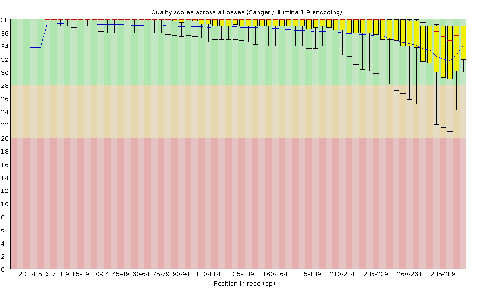
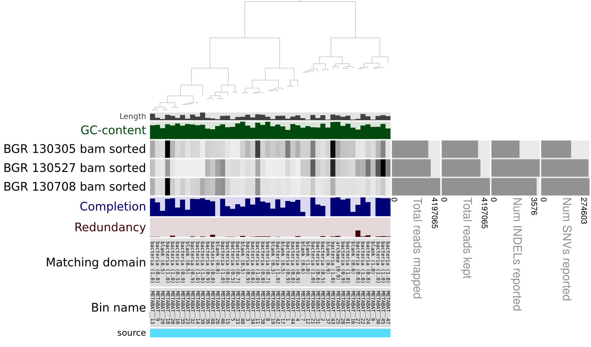
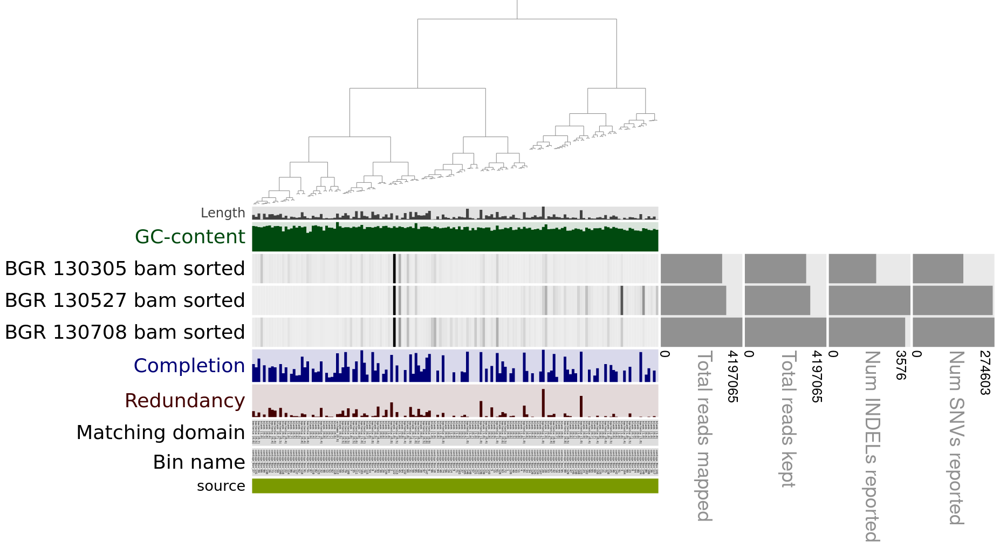
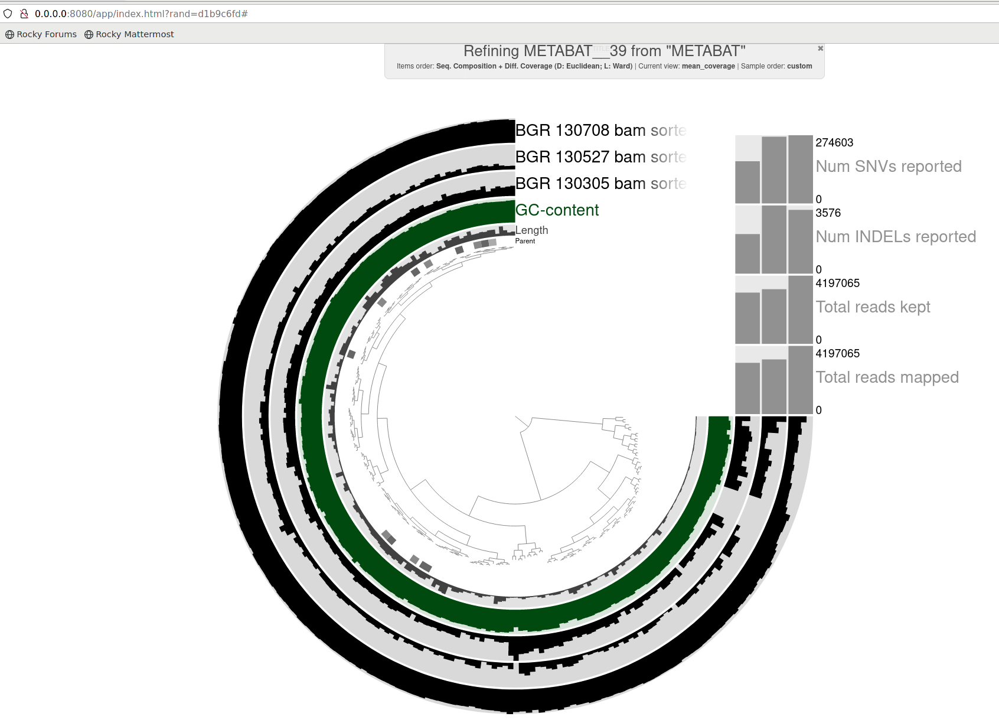

# Microbial Omics Course (biol217) Protocol - Nils Groeters

# Day 1: Introduction to Linux, Markdown, Git and Conda

### 1 Linux

What we have learned so far:

1. Basic Linux
2. Bioinformatic basics
3. Linux commands

- copy from one folder to another:

```sh
cp source destination
```

# Day 2: Introduction to Metagenomics and Metagenomic Workflow

### Metagenomics

Only a small percentage of the global microbial diversity can be cultured in the lab. In order to study microbes in their natural environment, metagenomic analysis can be used. By sequencing of the genomic DNA, plasmids or transcriptomes it is possible to investigate the microbial diversity.


- Limitations: only proportions, not absolut values of microbes in the environment (see slide 16)

Amplicon Sequencing

- 16S ribisome: 2 gene fused together, very conserved over many domains with conserved and "hyper-variable" regions, conserved regions can be targeted by primers to amplify the vaaible regions
- merenlab.org/momics
- Limitation: only known regions betwenn primers are amplified, mostly 16S RNA (missing plasmids, phages, eucaryotes)
--> shotgun-metagenomic sequencing captures alle sequences

Metagenomic Workflow
(slide 40, 41)

 Sequencing:

- quality control (slide43)
- Phred score for probability of incorrect sequncing result (>20 is good)
- **fastq** file format = read file: contains short reads (up to 150bp)
- sequncing trimming for longer reads with bad quality at the end (phasing or signal decay)

Assembly:

- refernce-guided: known sequences from reference
- de-novo: overlap or de Bruijn
- k-mer: nr of nucleotides looked at at once

## Assembly of Short Read Sequences on the CAU Cluster (Workflow)

Connect to the CAU cluster by ssh and change to the working directory:

```bash
ssh -X sunam230@caucluster.rz.uni-kiel.de

cd $WORK
```

*Note: For every job a bash script needs to be submitted according to the CAU cluster documentation ([CAU-Cluster](https://www.hiperf.rz.uni-kiel.de/caucluster/)). In order to use the following prigrams the anvio-8 environment needs to be loaded by conda every time a new job is submitted.*

### Program Documentations

| Tool | Version | Repository |
| --- | --- | --- |
| fastqc | 0.12.1 | [FastQC](https://github.com/s-andrews/FastQC ) |
| fastp | 0.23.4 | [fastp](https://github.com/OpenGene/fastp ) |
| megahit | 1.2.9 | [megahit](https://github.com/voutcn/megahit ) |
| samtools | 1.19 | [samtools](https://github.com/samtools/samtools ) |
| QUAST | 5.2.0 | [quast](https://quast.sourceforge.net/quast ) |
| Bowtie2 | 2.4.5 | [bowtie2](https://bowtie-bio.sourceforge.net/bowtie2/index.shtml ) |
| binsanity | 0.5.3 | [binsanity](https://github.com/edgraham/BinSanity) |
| MetaBAT2 | 2.12.1 | [Metabat2](https://bitbucket.org/berkeleylab/metabat/src/master/ ) |
| DASTool | 1.1.5 | [DAS_Tool](https://github.com/cmks/DAS_Tool ) |
| anvi´o | 8 | [anvi’o](https://anvio.org/ ) |
| GUNC | 1.0.5 | [GUNC](https://grp-bork.embl-community.io/gunc/ ) |


**1.** First task is to run multiple raw read files with the **fastqc** program. This program analysis the short read sequences and visualizes the quality scores. The command is included inside the bash script, containing the job, and is handed in on the cau cluster.

Open a bash script file with the emacs editor:

```bash
emacs [filename] &
```

```bash
#!/bin/bash
#SBATCH --nodes=1
#SBATCH --cpus-per-task=4
#SBATCH --mem=10G
#SBATCH --time=5:00:00
#SBATCH --job-name=fastqc
#SBATCH --output=fastqc.out
#SBATCH --error=fastqc.err
#SBATCH --partition=all
#SBATCH --reservation=biol217

module load gcc12-env/12.1.0
module load miniconda3/4.12.0
conda activate anvio-8

cd /work_beegfs/sunam230/[SOURCE DIRECTORY]

# a for loop is used to loop over i files with the ending *fastq.gz
for i in *fastq.gz; do fastqc $i -o [OUTPUT FILE]; done
```
Submit the job:

```bash
sbatch [filename]
```

Tracking the job on the cluster:
 ```bash
 squeue -u [USERNAME]
 ```


 Quality information from fastqc:

 

**2.** The next task is to run the **fastp** program in order to clean up the raw read files. This is done in pairs (R1/R2), which result from the sequencing method in both directions. **fastp** can not run in a loop over multiple files and has to be executed seperatly for each file pair. The information on the quality of the reads (obtained from **fastqc**) is used for the following setting.

Command line for fastp:
```
fastp -i ? -I ? -R ? -o ? -O ? -t 6 -q 20

> `--html` creates an .html report file in html format\
>`-i` R1 input file name\
>`-I` R2 input file name\
>`-R` report title, here ‘_report’ is added to each file\
>`-o` output_folder/R1.fastq.gz output file\
>`-O` output_folder/R2.fastq.gz output file\
>`-t` trim tail 1, default is 0, here 6 bases are trimmed\
>`-q` 20 reads with a phred score of <=20 are trimmed
```

```bash
#!/bin/bash
#SBATCH --nodes=1
#SBATCH --cpus-per-task=4
#SBATCH --mem=10G
#SBATCH --time=5:00:00
#SBATCH --job-name=fastp
#SBATCH --output=fastp.out
#SBATCH --error=fastp.err
#SBATCH --partition=base
#SBATCH --reservation=biol217

module load gcc12-env/12.1.0
module load miniconda3/4.12.0
conda activate anvio-8

cd /work_beegfs/sunam230/[SOURCE DIRECTORY]
fastp -i BGR_130708_mapped_R1.fastq.gz -I BGR_130708_mapped_R2.fastq.gz -R _report -o ../2_fastp/BGR_130708_mapped_clean_R1.fastq.gz -O ../2_fastp/BGR_130708_mapped_clean_R2.fastq.gz -t 6 -q 20

fastp -i [R1 FILE] -I [R2 FILE] -o [CLEANED R1 FILE] -O [CLEANED R2 FILE] -t -q
...
...
```

**3.** The assembly of the cleaned reads is done by **megahit**. The program takes in all R1 and R2 short read pairs and the output is directed to one folder:

```bash
megahit -1 [R1 FILE] -1 [R1 FILE] -1 [R1 FILE] -2 [R2 FILE] -2 [R2 FILE] -2 [R2 FILE] --min-contig-len 1000 --presets meta-large -m 0.85 -o [OUTPUT FOLDER] -t 12        
```

# Day 3: From Contigs to Bins (Binning)

- Contigs: proportion of contigs do not mirror reality, inrormation from sequncing data needed
- k-mer of 4 best for computing
- sequnce composition into MAGs ???
- back mapping of all short reads to the reulting contig (by fastp) gives different coverages, usually ca 7 --> all contigs from one species should have similiar coverage
- Binning on slide 143 (basis GC-content, kmer composition, covarage for most programs)

- quality control (QC) of MAGs: marker genes (SCGs), genomic characteristics on slide 146
- 16S RNA data hard to resolve in MAGs
- Minimum information about MAG standards (MIMAG) to compare MAG qualities
- MAG: collection of many strains (NOT a single strain!!) 
- SNP analysis in the coverage: same SNPs are hint for same strain, different indicate strain divergence
- slide 151: fragmentation can be indicated by high number of contigs needed for one MAG
- 

## Workflow Quality Assessment of Assemblies

**1.** Count number of contigs in the assembly file:
```bash
grep -c ">" final.contigs.fa
```
**2.** Creating -fastg file for later visualization with **Bandage**:

```bash
megahit_toolkit contig2fastg 99 final.contigs.fa > final.contigs.fastg
```
Afterwards download the .fastg file to the local PC for visualization:

```bash
#ON A LOCAL TERMINAL
scp sunam230@caucluster.rz.uni-kiel.de:/work_beegfs/sunam230/...
```

**3.** Quality Assessment of Assemblies with **metaquast**:

```bash
metaquast -t 6 -o /PATH/TO/3_metaquast -m 1000 final.contigs.fa

# -t specifies the number of threads
# -m specifies the lower contig threshhold
```

N50: half the length of the longest assembled contig

L50:


## Workflow Genome Binning

**1.** Making the final contig file .fa compatible with anvi for mapping and binning later on:
```bash
anvi-script-reformat-fasta final.contigs.fa -o contigs.anvio.fa --min-len 1000 --simplify-names --report-file name_conversion.txt
```
**2.** Mapping of the cleaned raw reads (.fasta.gz files) to the reformated contig (.anvio.fa):

```shell script
#!/bin/bash
#SBATCH --nodes=1
#SBATCH --cpus-per-task=4
#SBATCH --mem=10G
#SBATCH --time=5:00:00
#SBATCH --job-name=mapping2
#SBATCH --output=mapping2.out
#SBATCH --error=mapping2.err
#SBATCH --partition=base
#SBATCH --reservation=biol217

module load gcc12-env/12.1.0
module load miniconda3/4.12.0
conda activate anvio-8

module load bowtie2

cd /work_beegfs/sunam230/Metagenomics/2_fastp
for i in `ls *_R1.fastq.gz`;
do
    second=`echo ${i} | sed 's/_R1/_R2/g'`
    bowtie2 --very-fast -x ../3_coassembly/contigs.anvio.fa.index -1 ${i} -2 ${second} -S ../4_mapping/"$i".sam
done
```

**bowtie2** produces a .sam file, which holds the coverage for ech contig sequence. These files are very big and need to be converted into binary alignment and map file (.bam) by **samtools**. These files can be visualized later:

```shell script
module load samtools
cd /work_beegfs/sunam230/[MAPPING OUTPUT]
for i in *.sam;
do samtools view -bS $i > "$i".bam; done
```
## Workflow Contigs Data Preparation (anvio)

**1.** Convert the .fa file (contigs) into .db file by **anvi-gen-contigs-database**:
```shell script
anvi-gen-contigs-database -f contigs.anvio.fa -o contigs.db -n 'biol217'
```

**2.** Hidden markov model search on contigs. HMM searches for known patterns from databases:

```shell script
#!/bin/bash
#SBATCH --nodes=1
#SBATCH --cpus-per-task=4
#SBATCH --mem=10G
#SBATCH --time=5:00:00
#SBATCH --job-name=anvi-run
#SBATCH --output=anvi-run.out
#SBATCH --error=anvi-run.err
#SBATCH --partition=base
#SBATCH --reservation=biol217

module load gcc12-env/12.1.0
module load miniconda3/4.12.0
conda activate anvio-8

cd /work_beegfs/sunam230/Metagenomics/3_coassembly
anvi-run-hmms -c contigs.db
```

**3.** Assigning the terminal to a node on the CAU cluster (the front end is not suitable for running anvi´o interactive):
```shell script
# DIRECTLY IN THE TERMINAL:
srun --reservation=biol217 --pty --mem=10G --nodes=1 --tasks-per-node=1 --cpus-per-task=1 --nodelist=n100 /bin/bash
```
Afterwards the user runs directly on the specified node:

```
 [sunam230@n100 nilsg]$ 
 ```

And the condo environment has to be loaded again on this node in order to run **anvi-display-contigs-status**:

```shell script
# DIRECTLY IN THE TERMINAL on the computing node

module load gcc12-env/12.1.0
module load miniconda3/4.12.0
conda activate anvio-8

anvi-display-contigs-stats contigs.db
```
In a new terminal we login into the node by ssh:

```shell script
ssh -L 8060:localhost:8080 sunam###@caucluster.rz.uni-kiel.de
ssh -L 8080:localhost:8080 n###
```
The link http://127.0.0.1:8060 or http://127.0.0.1:8080 can be opened in the browser om the local PC! The program shows the stats of the database file (.db):

[Database report](./reports/contig_database/Contigs%20DB%20Stats.pdf)

## Workflow Binning with ANVI´O

**1.** Sorting and indexing of mapping files (.bam) with **anvi-init-bam**. This uses **samtools** in the background:

```bash
#bash script
for i in *.bam; do anvi-init-bam $i -o "$i".sorted.bam; done
```

**2.** Genome binning by **anvi´o**. The contigs will be grouped and assigned to individuel genomes. **anvi´o** uses binners like Metabat2 and binsanity in the background:

- creating an anvi´o profile from .sorted.bam and .contig.db (only precesses contigs longer than 2500nts):
```bash
#!/bin/bash
#SBATCH --nodes=1
#SBATCH --cpus-per-task=8
#SBATCH --mem=16G
#SBATCH --time=5:00:00
#SBATCH --job-name=anvi-profile
#SBATCH --output=anvi-profile.out
#SBATCH --error=anvi-profile.err
#SBATCH --partition=base
#SBATCH --reservation=biol217

module load gcc12-env/12.1.0
module load miniconda3/4.12.0
conda activate anvio-8

cd /work_beegfs/sunam230/Metagenomics/4_mapping
mkdir profiling_output
for i in `ls *.sorted.bam | cut -d "." -f 1`; do anvi-profile -i "$i".bam.sorted.bam -c ../3_coassembly/contigs.db -o ./profiling_output”$i”; done
```
The output folder contains the RUUNNLOG.txt and the PROFILE.db with key information about mappings from short reads to the contigs.
 
- merging profiles from different samples into one profile:

```bash
anvi-merge /PATH/TO/SAMPLE1/PROFILE.db /PATH/TO/SAMPLE2/PROFILE.db /PATH/TO/SAMPLE3/PROFILE.db -o /PATH/TO/merged_profiles -c /PATH/TO/contigs.db --enforce-hierarchical-clustering
```
- BINNING with two different binners (to avoid contamination in MAGs by refining different binning results), **Metabat2** and **Binsanity**:
```bash
#!/bin/bash
#SBATCH --nodes=1
#SBATCH --cpus-per-task=6
#SBATCH --mem=10G
#SBATCH --time=5:00:00
#SBATCH --job-name=binning-metabat2
#SBATCH --output=binning-metabat2.out
#SBATCH --error=binning-metabat2.err
#SBATCH --partition=base
#SBATCH --reservation=biol217

module load gcc12-env/12.1.0
module load miniconda3/4.12.0
conda activate anvio-8

cd /work_beegfs/sunam230/Metagenomics/5_anvio_profiles/profiling_output
anvi-cluster-contigs -p ./merged_profiles/PROFILE.db -c ../../3_coassembly/contigs.db -C METABAT --driver metabat2 --just-do-it --log-file log-metabat2
anvi-summarize -p ./merged_profiles/PROFILE.db -c ../../3_coassembly/contigs.db -o SUMMARY_METABAT -C METABAT

```
and 

```bash
#SBATCH script ...

module load gcc12-env/12.1.0
module load miniconda3/4.12.0
conda activate anvio-8

cd /work_beegfs/sunam230/Metagenomics/CC/5_anvio_profiles
nvi-cluster-contigs -p ./merged_profiles/PROFILE.db -c ../4_mapping/contigs.db -C BINSANITY --driver binsanity --just-do-it --log-file log-binsanity

anvi-summarize -p ./merged_profiles/PROFILE.db -c ../4_mapping/contigs.db -o SUMMARY_BINSANITY -C BINSANITY
```

QUESTIONS: How many Archaea bins did we get from MetaBAT2 and Maxbin2?

- MetaBat2 (3) only one Archaea with high completion percentage
- Binsanity (2)

Visual summary of bins from the different binners by:

```bash
#FRONT END TERMINAL

anvi-estimate-genome-completeness -p ./merged_profiles/PROFILE.db -c ../4_mapping/contigs.db --list-collections
#or -C [NAME OF BINNER]
```

Interactive summary of bins:

```bash
#FRONT END TERMINAL

anvi-interactive -p ./merged_profiles/PROFILE.db -c ../4_mapping/contigs.db -C METABAT
```

METABAT result contains 48 bins:



BINSANITY result contains 150 bins:




# Day 4:

Lecture: 

- Contamination in MAGs (MAG is a group of genomes from several species!!): by different genomes in one bin
- **single copy marker genes???** 
- solution: run different binners, compared in a bin REFINER
- solution: reuse (all reads an not just high abundance reads used in mapping) raw reads for mapping on original bins, which can give more information on the overlapping of contigs in one bin, ...
- chimera detection in MAGs: GUNC scoring (can resolve non-redundant combination of genes from different taxa in one bin) of CSS (based on taxonomic diversity in one contig compared to the other contiigs diversities): high RRS gives confidence based on reference database
- **completeness and contamination** (quality measures are completness % values)

- bin refinment: chimera detection (gene information compared to database), multiple binning, use raw reads and infos from .fastq

- MAG taxonomy (slide 173)


# Day 5:

Lecture:

- repition to integrated artifacts (virus, etc) : different nucleotide composition (e.g. GC content, tetranucleotide frequency)
- shotgun sequencing: 
#### TAXONOMY: (slide to present day approaches) 
- Phylogenomics uses howl genome datasets
- limitations if only based on 1 gene (eg 16S rRNA)
- Genome Taxonomy DataBase (average nucleotide identity and evolutionary divergence) holds many genomes, which are not cultivated. BUT lot of work to be done to avaluate MAG based data further
- ANI on slides: Alignment Fraction shows if there is still unshared sequences, even if the overlapping region has a high average coverage (also the alignment has to be hight together with the nucleotide identity) SCORE: >70% alignment fraction, >95% ANI are strong identifiers for two genomes belonging to the same species
- GTDB taxonomy assignemt output on slide 190, some species must be assigned even though they cannot be cultivated, different names between databases possible
- other databases: son slide ~195, JSpeciesW for comparison bewteen databases?

#### MAG 
- dereplication on slide 198
- abundance comparison between samples of the same environment possible by coverage values (ONLY RELATIVE VALUES): read recruitment (is there a best sequencing technique for comparible coverage values??)
- contigs/reads not used for final MAG binning: information used for profiling afterwards --> taxonomy slide 258 ff. Lowest common ancestor which shares a givin sequence- What other organisms might be present in a sample and could not be included in a MAG
- 

## Workflow Bin Refinement (only Archaea)

**1.** Identifieng the Archaea strain bins from the binning results respectively. Then copy the single bin directories into an extra directory with all bins selected for refinement.

**2.** Detection of chimerism and contamination by **GUNC**, which might result from mis-binning of genomic contigs from unrelated lineages. Therefore the output from seperate binners are used (in this script a different node and high memory is used for faster computation):

```bash
#!/bin/bash
#SBATCH --job-name=gunc
#SBATCH --output=gunc.out
#SBATCH --error=gunc.err
#SBATCH --nodes=1
#SBATCH --ntasks-per-node=1
#SBATCH --cpus-per-task=12
#SBATCH --mem=2000G
#SBATCH --partition=highmem
#SBATCH --qos=long
#SBATCH --time=10-00:00:00

module load gcc12-env/12.1.0
module load miniconda3/4.12.0
conda activate gunc

cd /work_beegfs/sunam230/Metagenomics/CC/5_anvio_profiles/ARCHAEA_BIN_REFINEMENT

mkdir GUNC

for i in *.fa; do gunc run -i "$i" -r /work_beegfs/sunam230/Databases/gunc_db_progenomes2.1.dmnd --out_dir GUNC/"$i" --threads 10 --detailed_output; done
```

```bash
#ONLY ONE BIN COULD BE VISUALIZED DO TO OVERWRITING OF gunc plot
gunc plot -d ./diamond_output/METABAT__39-contigs.diamond.progenomes_2.1.out -g ./gene_calls/gene_counts.json
```

Example visualization of a Archaeau METABAT bin:


**3.** Manual bin refinement with **anvi-refine**. The unrefinded bin will be OVERWRITTEN by this program, so the unrefindes bin need du be copied as backup. Then:

```bash
#TERMINAL

module load gcc12-env/12.1.0
module load miniconda3/4.12.0
conda activate anvio-8
anvi-refine -c ../4_mapping/contigs.db -C METABAT -p ./merged_profiles/PROFILE.db --bin-id Bin_METABAT__39
```

The contigs included in this MAG are shown for all different samples (BGR)




Different GC content is a first indicator for the integration of wrong genomes into the bin. Also the ebove

*questions from script...*


